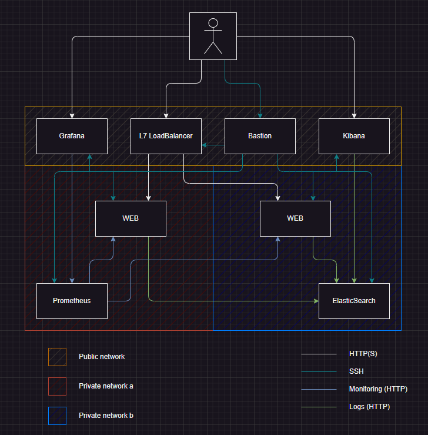
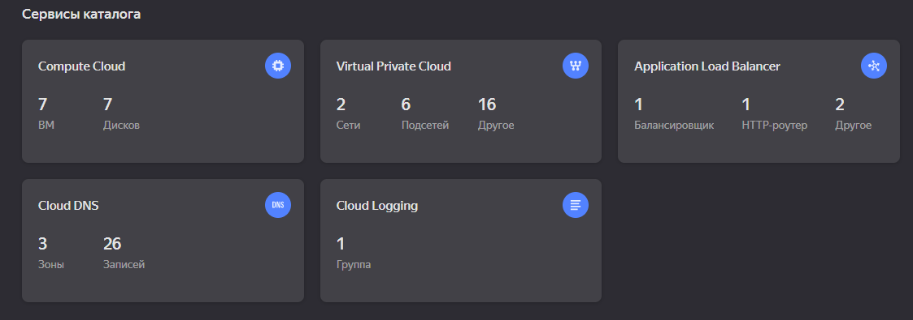
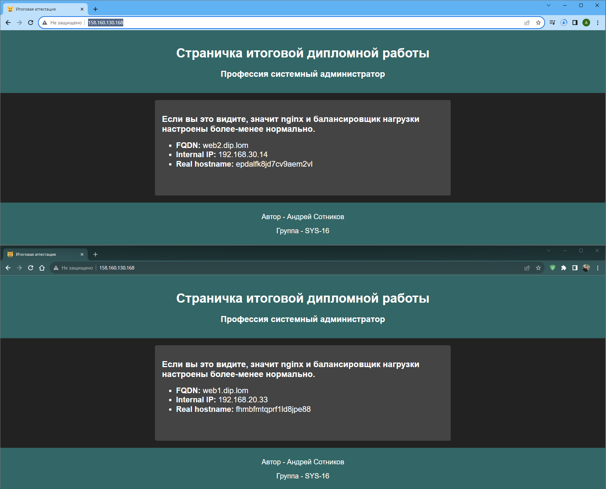
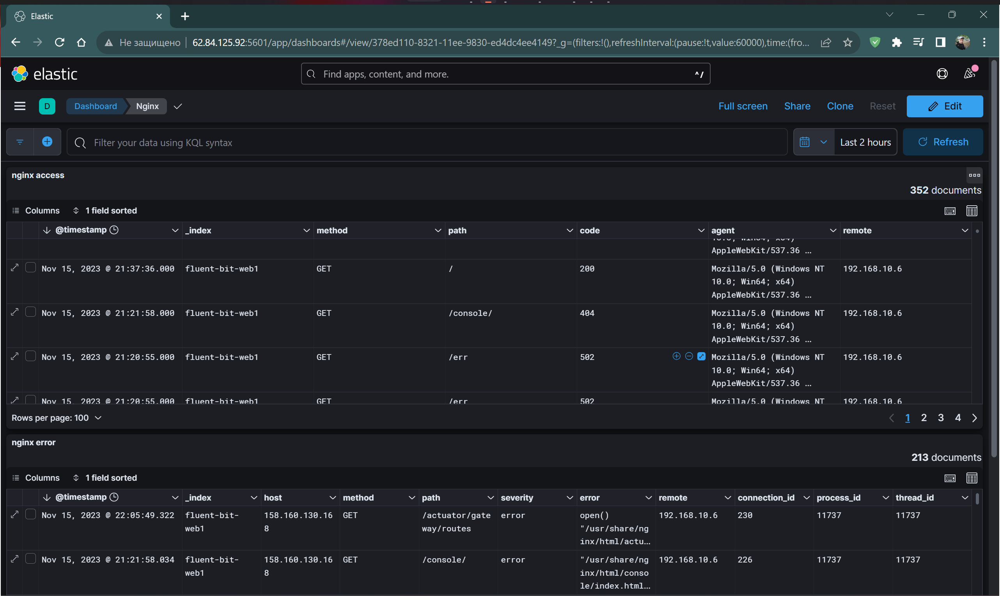
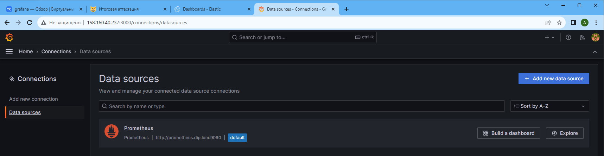
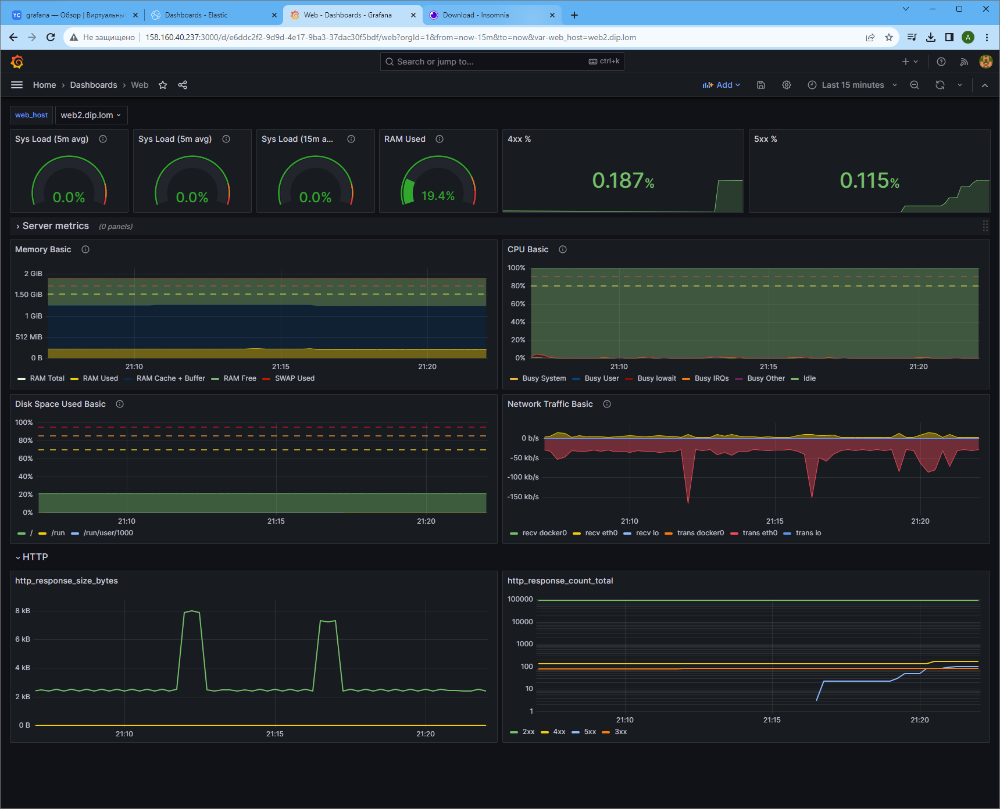

# Дипломная работа по профессии «Системный администратор» - Андрей Сотников

- [Дипломная работа по профессии «Системный администратор» - Андрей Сотников](#дипломная-работа-по-профессии-системный-администратор---андрей-сотников)
  - [Список использованного ПО](#список-использованного-по)
  - [План развертывания](#план-развертывания)
  - [Используемые ресурсы Yandex.Cloud](#используемые-ресурсы-yandexcloud)
    - [Виртуальные машины](#виртуальные-машины)
    - [Сеть и сетевое взаимодействие](#сеть-и-сетевое-взаимодействие)
      - [L7 Балансировщик нагрузки](#l7-балансировщик-нагрузки)
    - [Terraform](#terraform)
      - [Сводная таблица](#сводная-таблица)
      - [Условная схема сети](#условная-схема-сети)
  - [Развертывание сервисов с помощью Ansible](#развертывание-сервисов-с-помощью-ansible)
    - [Репозиторий Ansible](#репозиторий-ansible)
      - [Роли](#роли)
  - [Результаты](#результаты)
    - [Развертывание инфраструктуры](#развертывание-инфраструктуры)
    - [Развертывание сервисов](#развертывание-сервисов)
    - [Результаты развертывания](#результаты-развертывания)
    - [Создание дашбордов](#создание-дашбордов)
      - [Kibana](#kibana)
      - [Grafana](#grafana)
  - [Ссылки](#ссылки)

## Список использованного ПО

| SW | Версия |
| --- | --- |
| Ansible | 2.14.11 |
| Terraform | 1.6.3 |

## План развертывания

0. Получение аутентификационного токена Yandex.Cloud для управления облачными ресурсами через Terraform.
1. Создание [ресурсов](#используемые-ресурсы-yandexcloud) при помощи Terraform.
2. В ходе развертывания инфрастурктуры на Bastion сервер устанавливаются Git и Ansible, передается файл конфигурации ansible.cfg, затем производится загрузка ролей Ansible из VCS (GitHub).
3. Подключение по SSH к Bastion серверу и запуск плейбуков Ansible производится вручную, через SSH соединение, но можно настроить и автоматическое развертывание при помощи CI/CD-инструментов (например, Jenkins).
4. Запуск плейбука Ansible для развертывания и конфигурации сервисов при помощи [ролей](#роли).
5. Создание дашбордов в Grafana и Kibana.

## Используемые ресурсы Yandex.Cloud

### Виртуальные машины

Инфраструктура разворачивается на семи виртуальных машинах. В качестве ОС используется Fedora 37.  
Настроено автоматическое создание снэпшотов для всех дисков, с ежедневным копированием.  

Список ВМ с затребованными ресурсами представлен в сводной таблице.

### Сеть и сетевое взаимодействие

В проекте используется две приватных подсети без доступа в интернет (в разных сетевых зонах) и одна публичная подсеть. Доступ во вне есть со всех машин, осуществляется через NAT-шлюз, трафик в который заворачивается при помощи таблицы маршрутизации. Доступ к машинам ограничен с помощью security groups - открыты только нужные порты.  
Дополнительно каждой машине присвоена DNS-запись для облегчения взаимодействия внутри сети.

#### L7 Балансировщик нагрузки

Для маршрутизации входящего трафика к веб-серверам используется L7-балансировщик (Application Load Balancer), который состоит из целевой группы, в которую помещаются веб-серверы, бэкенд-группы, которая определяет настройки балансировки, роутера, который определяет правила маршрутизации запросов в группу бэкенда и балансировщика, который принимает трафик и передает его собственно на эндпоинты бэкендов согласно настройкам обработчиков.

### Terraform

Вышеупомянутые ресурсы разворачиваются при помощи HashiCorp Terraform с установленным провайдером YandexCloud.
Для облегчения работы конфигурация разбита на несколько файлов:

- **main.tf** - служебный файл с описанием провайдера, переменными и декларациями вывода.
- **bastion.tf**, **logs.tf**, **monitoring.tf** и **webservers.tf** - файлы, в которых описаны виртуальные машины. Название описывает сервис или предназначение ВМ. Здесь же прописаны параметры резервного копирования для дисков.
- **load_balancer.tf** - файл для создания L7 балансировщика со всеми необходимыми сущностями.
- **network.tf** - файл, описывающий конфигурацию сети. В нем задаются подсети, шлюз, таблица маршрутизации и все группы безопасности.

Помимо этого, при развертывании ВМ используются файл с метаданными meta.yml, благодаря которому на всех машинах, кроме bastion, создается нужный пользователь (ansible) с добавлением публичного ключа в authorized_keys. С помощью этого ключа осуществляется беспарольное подключение ansible-контроллера к хостам. Файл bastion.yml также содержит метаданные, но уже для bastion-хоста. Кроме создания пользователя, в нем задан список пакетов, которые требуется установить после развертывания (`git` и `ansible`), а также команда на клонирование репозитория [diplom_ansible](https://github.com/a-sotnikov/diplom_ansible).

#### Сводная таблица

| Наименование | ППО | CPU | RAM | Внутренний FQDN | Подсеть |
| --- | --- | --- | --- | --- | --- |
| webserver-1 | Nginx | 2 | 2G | web1.dip.lom | private-subnet-a |
| webserver-2 | Nginx | 2 | 2G | web2.dip.lom | private-subnet-b |
| prometheus | Prometheus | 2 | 4G | prometheus.dip.lom | private-subnet-b |
| grafana | Grafana | 2 | 2G | grafana.dip.lom | public-subnet |
| elaticsearch | ElaticSearch (in Docker) | 2 | 4G | es.dip.lom | private-subnet-a |
| kibana | Kibana (in Docker) | 2 | 4G | kibana.dip.lom | public-subnet |
| bastion-host | Ansible | 2 | 1G | bastion.dip.lom | public-subnet |

#### Условная схема сети



## Развертывание сервисов с помощью Ansible

Так как этот шаг производится после развертывания инфраструктуры, в том числе, после применения правил групп безопасности, Ansible-контроллер размещен на Bastion-сервере, с которого имеется доступ по SSH на все остальные машины.

Во время разворачивания Bastion на него устанавливаются пакеты `git` и `ansible`, затем выполняется `git clone` репозитория с плейбуком и ролями Ansible.

### Репозиторий Ansible

Состав репозитория:

- **ansible.cfg** - конфигурационный файл ansible;
- **ansible.key** - приватный ключ для доступа к ВМ по SSH. Чтобы не хранить ключ в открытом виде, он зашифрован при помощи утилиты `ansible vault`. Расшифровка происходит первым шагом при запуске плейбука. Для расшифровки требуется пароль, который в данном случае вводится через аргумент командной строки `--ask-vault-pass=` при запуске плейбука;
- **config.yml** - файл с переменными, который подгружается при исполнении плейбука. В нем можно указать версии используемых сервисов, которые требуется установить, можно установить флаг для пропуска установки (например, если нужно только обновить конфигурацию уже установленного сервиса). Некоторые параметры конфигурации тоже выведены в этот файл;
- **inventory.yml** - файл с перечнем хостов, которые логически сгруппированы. В качестве адреса хоста используется DNS-запись, что позволяет не править IP-адреса при каждом редеплое инфраструктуры. Здесь же путем группировки можно изменить перечень хостов, на который устанавливается тот или иной сервис (например, если добавить хост в группу docker, на него установится docker);
- **playbook.yml** - основной плейбук, который первым шагом расшифровывает приватный ключ, а затем по очереди запускает деплой сервисов, используя соответствующие роли.

#### Роли

1. **webservers** - установка `Nginx` и статики, обновление статики;
1. **metrics** - установка и конфигурация экспортеров (`NodeExporter`, `NgninxlogExporter`);
1. **grafana** - установка и конфигурация `Grafana`;
1. **prometheus** - установка и конфигурация `Prometheus`;
1. **docker** - установка docker на виртуальные машины для `ElasticSearch` и `Kibana`;
1. **elasticsearch** - установка и конфигурация `Elasticsearch`;
1. **kibana** - установка и конфигурация `Kibana`;
1. **fluent-bit**/filebeat* - установка сборщика логов;

> *По умолчанию в качестве beat выбран `fluent-bit`, так как `filebeat` не доступен для свободной загрузки, а запускать его в контейнере и прокидывать туда логи nginx кажется не самым оптимальным решением, плюс есть сложности с правами. Однако, возможность установки `docker` и `filebeat` есть, нужно лишь отредактировать inventory-файл, добавив в группу `docker-servers` хосты с `nginx`, и раскоментировать соответствующую таску в плейбуке.

## Результаты

### Развертывание инфраструктуры

Запускается с персональной машины с установленным Terraform.

```sh
❯ terraform --version
Terraform v1.6.3
on linux_amd64
+ provider registry.terraform.io/yandex-cloud/yandex v0.92.0
```

Все конфигурационные файлы и файлы с метаданными для развертывания расположены в данном репозитории в директории `/terraform`. После перехода в нее осуществляется запуск развертывания командой

```sh
❯ terraform apply
```

[Файл с содержимым stdout](materials/logs/terraform_apply.log)

В конце выводятся публичные ip адреса bastion-хоста, Grafana, Kibana и балансировщика нагрузки.

Веб интерфейс Yandex.Cloud:  


### Развертывание сервисов

Для деплоя сервисов нужно подключиться по ssh на bastion-сервер. Так как при развертывании на него добавляется публичная часть ключа, приватная же - на моей машине. Поэтому доступ осуществляется без пароля.

В домашней папке пользователя ansible уже находится скачанный репозиторий [diplom_ansible](https://github.com/a-sotnikov/diplom_ansible), который находится в Github в открытом доступе. Именно поэтому приватный ключ `ansible.key`, с которым осуществляется доступ до всех остальных развернутых машин, зашифрован паролем через `ansible-vault`. Для его расшифровки можно воспользоваться командой `ansible-vault decrypt <file>`, но эта операция включена в плейбук первой же play, поэтому достаточно запустить его на исполнение командой

```sh
ansible-playbook playbook.yml  --ask-vault-pass
```

и ввести пароль.

[Файл с содержимым stdout](materials/logs/ansible-playbook.log)

### Результаты развертывания

После того, как исполнение плейбука завершено, можно в браузере перейти по [IP-адресу балансировщика нагрузки](http://158.160.130.168/) и увидеть сайт. Если обновивить страницу со сбросом кэша, отображаемая информация изменится (так как запрос пойдет на другой nginx):



Сделано это при помощи шаблонирования файла `index.html`.

По IP-адресам [Grafana](http://158.160.40.237:3000/d/e6ddc2f2-9d9d-4e17-9ba3-37dac30f5bdf/web?orgId=1) и [Kibana](http://62.84.125.92:5601/app/dashboards#/view/378ed110-8321-11ee-9830-ed4dc4ee4149?) также доступны соответствующие серверы.

### Создание дашбордов

#### Kibana

После деплоя Kibana уже может отображать данные из ElasticSearch без каких-либо манипуляций, остается лишь создать шаблоны индексов, сформировать поисковые запросы и вынести их на дашборд *(и включить темную тему🙂)*:



#### Grafana

Первым делом нужно залогиниться со стандартными данными (admin/admin), поменять пароль при необходимости и добавить Prometheus в Data Sources:



Затем настроить дашборд:



Часть визуализаций серверных метрик позаимствована в шаблоне Node Exporter Full (id 1860).

## Ссылки

Репозиторий с конфигурацией Ansible - [github.com/a-sotnikov/diplom_ansible](https://github.com/a-sotnikov/diplom_ansible)  
Grafana - [158.160.40.237:3000](http://158.160.40.237:3000/d/e6ddc2f2-9d9d-4e17-9ba3-37dac30f5bdf/web?orgId=1)  
Kibana - [62.84.125.92:5601](http://62.84.125.92:5601/app/dashboards#/view/378ed110-8321-11ee-9830-ed4dc4ee4149?)  
Балансировщик с сайтом - [158.160.130.168:80](http://158.160.130.168/)
